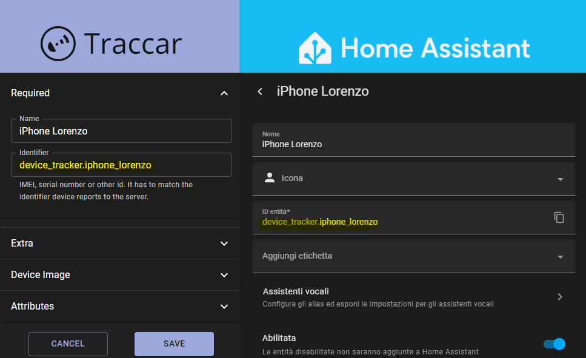
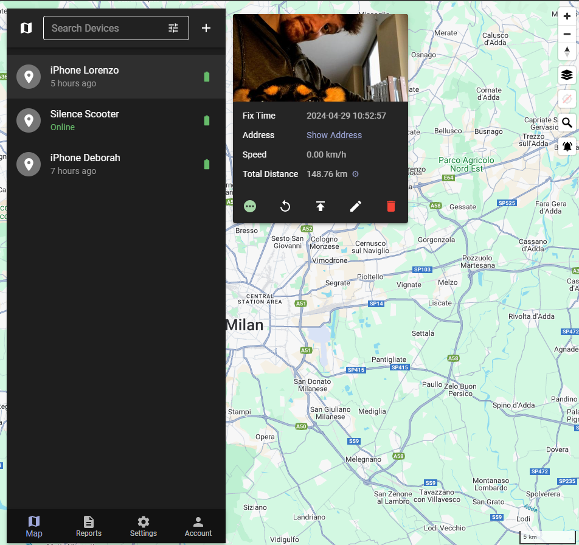

# Home Assistant Traccar Device Tracker Integration

This package enables the integration of Home Assistant `device_tracker` entities into the Traccar GPS tracking system by synchronizing device IDs across both platforms.
If you like this project you can support me with :coffee: or simply put a :star: to this repository :blush:

## Table of Contents
1. [Requirements](#requirements)
2. [Installation](#installation)
   - [Step 1: Configure Traccar Device](#step-1-configure-traccar-device)
   - [Step 2: Import YAML File](#step-2-import-yaml-file)
   - [Step 3: Configure Traccar Server IP](#step-3-configure-traccar-server-ip)
   - [Step 4: Add Device IDs](#step-4-add-device-ids)
3. [Usage](#usage)
4. [Support](#support)
5. [Contributing](#contributing)
6. [License](#license)
7. [Acknowledgments](#acknowledgments)

## Requirements
- **Home Assistant** instance running
- Accessible **Traccar Server**

## Installation
Follow these steps to install and configure the integration:

### Step 1: Configure Traccar Device
1. Log in to your Traccar server.
2. Create a new device for each `device_tracker` you wish to monitor.
3. Ensure the device ID in Traccar matches the `device_tracker` ID in Home Assistant, as in picture.

### Step 2: Import Package YAML File
1. Download the `traccar_positioning.yaml` file from this repository.
2. Place the file into the `packages` folder of your Home Assistant configuration.

   If the `packages` folder does not exist, you will need to create it following the [official documentation](https://www.home-assistant.io/docs/configuration/packages/).

### Step 3: Configure Traccar Server IP
1. Open the `traccar_positioning.yaml` file with a text editor.
2. Replace the `traccar_server_ip` and `traccar_server_port` value with the IP address and Port (default for the used protocol is **5055**) of your Traccar server instance.

### Step 4: Add Device IDs
1. In the `traccar_positioning.yaml` file, add the IDs of the devices you want to track under the `device_tracker.<device_tracker_1>` keys.
2. Ensure the IDs match exactly those configured in Traccar.

## Usage
After completing the installation and configuration, your Home Assistant `device_tracker` entities will be synchronized with Traccar, allowing you to monitor their real-time location.

## Support
If you encounter any issues or have questions regarding the integration, please open an issue on this GitHub repository, and I will be happy to assist you.
You can write to me at [me@lorenzodeluca.dev](mailto:me@lorenzodeluca.dev?subject=homeassistant-traccar)

## Contributing
Contributions to the project are welcome! Please fork the repository, make your changes, and submit a pull request.

## License
This project is licensed under the MIT License - see the [LICENSE.md](LICENSE.md) file for details.
GNU AGPLv3 © [Lorenzo De Luca][https://lorenzodeluca.dev]

## Acknowledgments
- Thanks to the Home Assistant community for providing a robust platform for home automation.
- Gratitude to the Traccar team for their excellent GPS tracking system.
