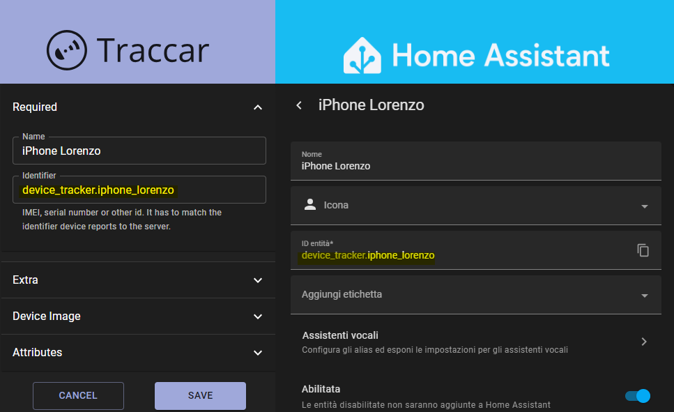
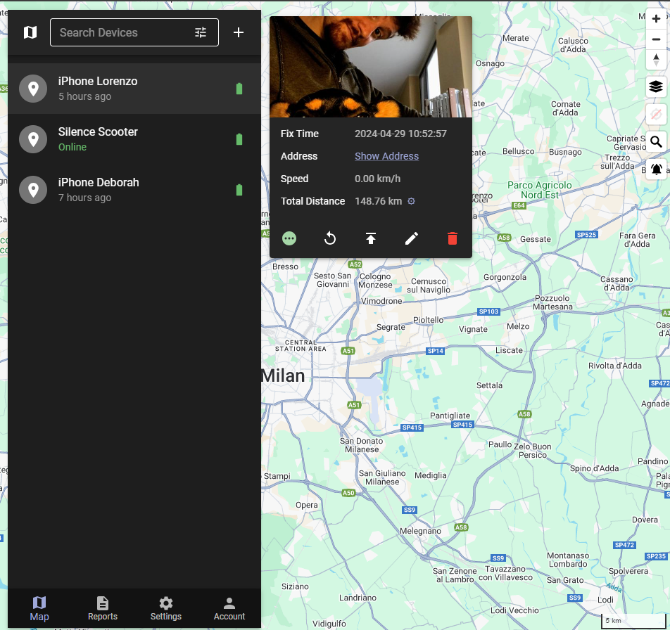

# Home Assistant Traccar Device Tracker Integration


[](https://github.com/sponsors/lorenzo-deluca)
[](https://www.buymeacoffee.com/lorenzodeluca)

This package enables the integration of Home Assistant `device_tracker` entities into the Traccar GPS tracking system by synchronizing device IDs across both platforms.
If you like this project you can support me with :coffee: , with **GitHub Sponsor** or simply put a :star: to this repository :blush:

[](https://github.com/sponsors/lorenzo-deluca)
<a href="https://www.buymeacoffee.com/lorenzodeluca" target="_blank">
  
</a>

## Table of Contents
1. [Requirements](#requirements)
2. [Installation](#installation)
   - [Step 1: Configure the Traccar Device](#step-1-configure-the-traccar-device)
   - [Step 2: Add the REST Command Package](#step-2-add-the-rest-command-package)
   - [Step 3: Import the Automation Blueprint](#step-3-import-the-automation-blueprint)
3. [Usage](#usage)
4. [Troubleshooting](#troubleshooting)
5. [Support](#support)
6. [Contributing](#contributing)
7. [License](#license)
8. [Acknowledgments](#acknowledgments)

## Requirements
- **Home Assistant** instance running, with access to its `configuration.yaml` (for the one-time package step below)
- Accessible **Traccar Server**

## Installation
There is no custom integration or HACS package to install — this project is made of two small, standard Home Assistant building blocks: a **package** (a `rest_command` that knows how to talk to Traccar) and an **automation blueprint** (that decides when to send updates, using the UI, without writing any YAML). You set up the package once, then import the blueprint with one click.

### Step 1: Configure the Traccar Device
1. Log in to your Traccar server.
2. Create a new device for each `device_tracker` you wish to monitor.
3. Set the device **Identifier** in Traccar to the exact `entity_id` of the corresponding `device_tracker` in Home Assistant (e.g. `device_tracker.pixel_7`), as shown in the picture.



### Step 2: Add the REST Command Package
This file only needs to be added once — it does **not** need any editing, since the Traccar server URL and device IDs are provided later through the blueprint's UI.

1. Download [`traccar_positioning.yaml`](packages/traccar_positioning.yaml) from this repository.
2. Place the file into the `packages` folder of your Home Assistant configuration (`config/packages/`).

   If you don't have a `packages` folder yet, create it and make sure packages are enabled in your `configuration.yaml`:
   ```yaml
   homeassistant:
     packages: !include_dir_named packages
   ```
   See the [official documentation](https://www.home-assistant.io/docs/configuration/packages/) for more details.
3. Restart Home Assistant to load the new `rest_command.update_traccar` service.

### Step 3: Import the Automation Blueprint
Instead of writing or editing any automation YAML, import the blueprint directly into your Home Assistant instance with one click:

[](https://my.home-assistant.io/redirect/blueprint_import/?blueprint_url=https%3A%2F%2Fgithub.com%2Florenzo-deluca%2Fhomeassistant-traccar%2Fblob%2Fmaster%2Fblueprint-homeassistant-traccar.yaml)

1. Click the badge above (it will open your Home Assistant instance and prompt you to import the blueprint — if it doesn't open automatically, go to **Settings > Automations & Scenes > Blueprints > Import Blueprint** and paste this repository's [blueprint URL](blueprint-homeassistant-traccar.yaml)).
2. Once imported, go to the new blueprint and select **Create Automation**.
3. Fill in the **Traccar Server URL** field (e.g. `http://192.168.1.1:5055`, port `5055` is the default for the HTTP protocol).
4. Select the **Tracking Devices** (`device_tracker` entities) you want to sync with Traccar.
5. Save the automation.

That's it — no more manual YAML editing for the server address or the list of tracked devices; both are configured from the automation's UI form, and adding or removing a device is just a matter of editing the automation's entity list.

## Usage
After completing the installation and configuration, your Home Assistant `device_tracker` entities will be synchronized with Traccar, allowing you to monitor their real-time location.



## Troubleshooting
- **Position doesn't update in Traccar**: check **Settings > Automations & Scenes**, open the automation created from the blueprint, and look at its trace/logbook after moving the device — the `rest_command.update_traccar` action should show as `continue_on_error`, so a failed call won't stop the automation, but you can still inspect the response in the trace.
- **`rest_command.update_traccar` service not found**: the `traccar_positioning.yaml` package wasn't loaded — confirm it's inside your `packages` folder, that `packages: !include_dir_named packages` is set in `configuration.yaml`, and that you restarted Home Assistant after adding it.
- **Device not appearing / not moving in Traccar**: double-check that the device **Identifier** you set in Traccar exactly matches the Home Assistant `entity_id` (including the `device_tracker.` prefix), as that full string is what gets sent as the `id` parameter.

## Support
If you encounter any issues or have questions regarding the integration, please open an issue on this GitHub repository, and I will be happy to assist you.
You can write to me at [me@lorenzodeluca.dev](mailto:me@lorenzodeluca.dev?subject=homeassistant-traccar)

## Contributing
Contributions to the project are welcome! Please fork the repository, make your changes, and submit a pull request.

## License
This project is licensed under the MIT License - see the [LICENSE.md](LICENSE.md) file for details.
GNU AGPLv3 © [Lorenzo De Luca][https://lorenzodeluca.dev]

## Acknowledgments
- Thanks to the Home Assistant community for providing a robust platform for home automation.
- Gratitude to the Traccar team for their excellent GPS tracking system.
